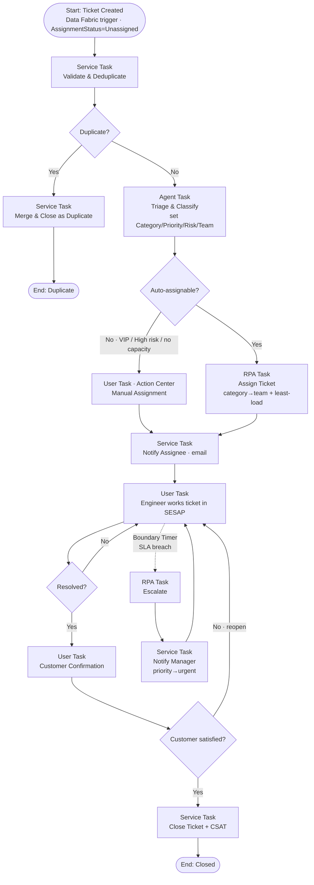

# SESAP — Maestro BPMN Process Design

> **📌 Canonical status:** The end‑to‑end loop is deployed and **verified working live**. [`README.md`](README.md) + [`docs/DEMO_WALKTHROUGH.md`](docs/DEMO_WALKTHROUGH.md) are the up‑to‑date source of truth. Any "not yet a process / not yet verified" notes below predate the fixes that made it work: the Maestro→RPA `Orchestrator.StartJob` binding (`TicketLifecycle` **v2.0.3**, process‑level `<uipath:bindings>`) and the app click‑trigger (**v2.8.1**, scopes `OR.Execution`/`OR.Folders.Read`/`OR.Jobs`). Treat this file as design background.

**Purpose:** orchestrate the full support-ticket lifecycle across robots, AI agents, and
people — starting with **Assign Ticket**, then scaling to the wider process flow.

**Tool:** **UiPath Maestro** (BPMN orchestration — already enabled on your tenant).
**Process data store:** the Data Fabric **`Ticket`** entity (already live).

| Org | Entity id |
|---|---|
| `stanbgdgzsbd` (personal) | `ca14332a-0081-f111-b338-000d3ab4d3b7` |
| `stanbvosiacv` (corporate) | `82fbd9d7-0f81-f111-b338-000d3ab4d3b7` |

---

## 1. Why BPMN here (and what Maestro adds)

Today SESAP writes a ticket and *nothing happens next* — a human must pick it up. A single
RPA process could auto-assign it, but you'd then bolt on escalation, approvals, reminders,
and customer confirmation as more disconnected automations.

Maestro instead makes the **process itself** the first-class thing:
- **Long-running** — a ticket can live for days; the process waits.
- **Mixed actors** — robots, AI agents, and humans (Action Center) in one flow.
- **Timers/SLA** — a boundary timer fires escalation automatically at breach.
- **Visibility** — every ticket's position in the flow is observable.
- **Versioned** — change the flow without rewriting the app.

---

## 2. The core process — *Support Ticket Lifecycle*



**Reading the diagram:** the dotted line is a **non-interrupting boundary timer** on *Work* —
when the SLA elapses the ticket escalates *without* cancelling the work in progress.

---

## 3. Task contracts

Each row is one BPMN node. "Status" = what exists today.

| # | Task | BPMN type | Implementation | Input | Output | Status |
|---|---|---|---|---|---|---|
| 1 | **Ticket Created** | Start (message/trigger) | Data Fabric trigger on `Ticket` *record created* | — | `Ref` | ✅ trigger source live (`insertRecord` raises events) |
| 2 | **Validate & Deduplicate** | Service task | Function/RPA — check required fields; match open `Ref`/`Subject`+`RequesterEmail` | `Ref` | `isDuplicate`, `duplicateOfRef` | ⬜ to build |
| 3 | **Merge & Close as Duplicate** | Service task | Set `Status=closed`, link `duplicateOfRef` | `Ref` | — | ⬜ |
| 4 | **Triage & Classify** | Agent task | AI Agent reads `Subject`+`Description` → fills `Category`, `SubCategory`, `Priority`, `RiskLevel` when missing | `Ref` | classified fields | ⬜ (rules fallback exists) |
| 5 | **Assign Ticket** | RPA task | **Category→Team + least-load** → write `AssignedTo`, `AssignmentStatus=Assigned`, `Team` | `Ref` | `assignedTo`, `team` | ✅ **logic proven** (`scripts/assign-tickets.mjs`) — ⬜ not yet a UiPath process |
| 6 | **Manual Assignment** | User task (Action Center) | Form: pick engineer; writes same fields as #5 | `Ref`, candidate list | `assignedTo` | ⬜ |
| 7 | **Notify Assignee** | Service task | Email — subject/body already built in `utils.js → assignmentEmail()` | `Ref`, `assignedTo` | `notifiedAt` | 🟡 template exists (client-side `mailto`); server send ⬜ |
| 8 | **Engineer works ticket** | User task | Engineer works in SESAP; completes when `Status=resolved` | `Ref` | `Status` | ✅ app supports |
| 9 | **Escalate** | RPA task | `escalated=true`, `Priority=urgent`, notify manager | `Ref` | — | 🟡 app has `escalateTicket()`; not a process |
| 10 | **Customer Confirmation** | User task | Email/portal confirm — customer accepts or reopens | `Ref` | `confirmed` | 🟡 Customer Portal can reply/reopen |
| 11 | **Close Ticket + CSAT** | Service task | `Status=closed`; send CSAT survey | `Ref` | `csat` | ⬜ |

**Legend:** ✅ done · 🟡 partially exists · ⬜ to build

---

## 4. Gateways & rules (the decisions)

| Gateway | Condition | Notes |
|---|---|---|
| **Duplicate?** | open ticket with same `RequesterEmail` + fuzzy `Subject` within 24h | Queue-level dedupe already exists via unique `Ref` |
| **Auto-assignable?** | `RiskLevel != High` **AND** `tags` ∌ `vip` **AND** team has ≥1 engineer | else → Manual Assignment |
| **Resolved?** | `Status == resolved` | loops until true |
| **Customer satisfied?** | confirmation reply | No → reopen (`Status=open`, keep assignee) |

**SLA boundary timer** — from the existing `SLA_HOURS` map (`utils.js`):

| Priority | SLA | Timer fires |
|---|---|---|
| urgent | 24h | at 24h → Escalate |
| high | 48h | at 48h |
| medium | 96h | at 96h |
| low | 168h | at 168h |

---

## 5. The assignment rule (task #5) — proven logic

Ported verbatim from `scripts/assign-tickets.mjs`, already validated against live data:

```
1. team      = CATEGORY_TEAM[ticket.Category]  (default "Tier 1 Support")
2. pool      = engineers where engineer.team == team
3. load[e]   = count(records where AssignedTo == e AND Status in (open,in_progress))
4. pick      = pool sorted by load ascending, first
5. write     → AssignedTo=pick.name, AssignmentStatus="Assigned", Team=team
6. emit      → assignedTo, email  (feeds task #7)
```

**Routing map**

| Category | Team |
|---|---|
| Payments | Payments Operations |
| Digital Banking | Tier 2 Support |
| Accounts / Lending | Tier 1 Support |
| Automation / RPA | Automation Team |
| Infrastructure | Infrastructure |

> **Live proof:** `SESAP-1048` (*Payments*) → Payments Operations → **Ngozi Eze**;
> `SESAP-VERIFY-366924` (*Digital Banking*) → Tier 2 Support → **Kunle Adeyemi**.

---

## 6. Additional scenarios (how this scales)

Each is a variant/sub-process on the same spine — this is the payoff of BPMN:

| Scenario | Flow change |
|---|---|
| **Robot failure ticket** | Orchestrator alert → auto-create ticket (`Category=Automation / RPA`) → skip Triage → assign Automation Team → attach robot logs |
| **VIP customer** | Gateway sends to **Manual Assignment** + priority boost; tighter SLA timer |
| **Approval needed** (e.g. refund) | Insert **User Task: Approval** between Work and Resolve; reject → back to Work |
| **Major incident** | If ≥N tickets on one `BusinessService` in 15 min → spawn Incident sub-process, link children, notify service owner |
| **Out-of-hours** | Timer/calendar gateway → route to on-call rota instead of least-load |
| **Reassignment** | If no `Status` change in 48h → reclaim and re-run **Assign Ticket** (excluding current owner) |

---

## 7. How to build it in Maestro

1. **Maestro → New Process** → name `SESAP Ticket Lifecycle`.
2. **Start event** → *Data Fabric trigger* on the `Ticket` entity, *record created*.
   (Your app's `insertRecord()` already raises these events — batch inserts would not.)
3. Drop nodes per §3, in the §2 order.
4. **Bind process data** to the entity — carry `Ref` as the correlation key; read/write
   fields via Data Fabric activities rather than copying state into the process.
5. **Attach a boundary timer** on *Work* using the §4 SLA table (drive it from `Priority`).
6. Implement tasks incrementally — **start with #5 Assign Ticket**; stub the rest as
   pass-throughs so the flow runs end-to-end from day one.
7. **Publish** → run → watch instances in Maestro's process view.

**Build order (recommended):**
```
#5 Assign  →  #7 Notify  →  #9 Escalate (timer)  →  #4 Triage (agent)  →  #2 Dedupe  →  #10/#11 Confirm + Close
```
Each step is independently demoable, and the flow is never broken while you build.

---

## 8. Known constraints (be aware before you start)

- **`Assign Ticket` still needs a runnable UiPath implementation.** The logic is proven, but
  it currently runs as a Node script, not a process. Options: build it in Studio (blocked
  today by the *"Local Robot failed to execute startJob"* designer error), or as a
  **Function** (blocked — `@uipath/coded-functions-js-sdk` is a gated npm package we can't
  install), or call it as an **API/service task** from Maestro.
- **Email** is client-side (`mailto`) today. Server-sent email needs a backend, an
  Integration Service connector, or a robot — task #7.
- **Human tasks** need **Action Center** (available on the tenant) for forms/approvals.
- **Execution needs a robot/runtime** for RPA tasks. Machines exist (`SBICNIGRPA01`);
  confirm an unattended runtime licence before publishing.

---

## 9. Fastest route to a working demo

If you want the loop closed *now* while the Studio/Function blockers are resolved:
implement **#5 Assign + #7 Notify inside SESAP** (the logic is already written and proven).
Tickets would then self-assign and email on submit, and Maestro later takes those steps over
one at a time — the entity contract stays identical, so nothing is thrown away.
