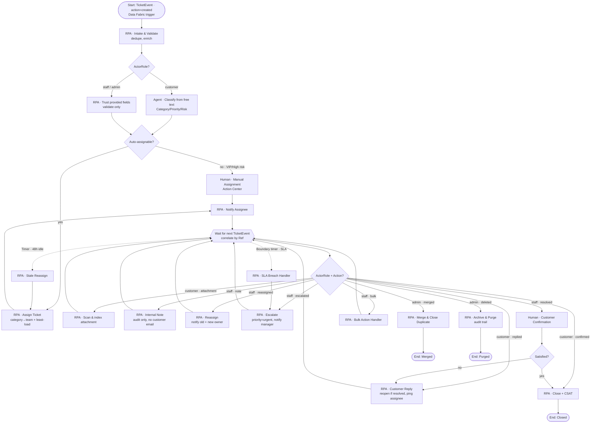

# SESAP — Designated RPA Workflows & Actor-Branching BPMN

> **📌 Canonical status:** See [`README.md`](README.md) + [`docs/DEMO_WALKTHROUGH.md`](docs/DEMO_WALKTHROUGH.md) for the current, verified end‑to‑end solution. The Maestro process (`TicketLifecycle` v2.0.3) invokes the `TicketAutomation` robot via `Orchestrator.StartJob`, proven live. This file is the workflow catalogue / design background.

**The ask:** every action in the app has a designated RPA workflow. Raising a ticket starts
a BPMN, which then **branches by who is acting** (Customer vs Staff/Admin) and **what they did**.

---

## 1. The architectural key: make actions *events*

Today the app writes ticket **state** to Data Fabric. State alone can't drive a BPMN — you
can't tell *"customer replied"* from *"agent escalated"* by diffing rows.

So add one thing: a **`TicketEvent`** entity. **Every app action writes an event row.** That
becomes the single trigger surface Maestro listens to, and it carries the actor's role —
which is exactly what lets the process branch by route.

```
 App action (staff or customer)
        │  writes
        ▼
 Data Fabric: TicketEvent  ──trigger──▶  Maestro BPMN (correlate by Ref)
        │                                      │ branch on actorRole + action
        │                                      ▼
 Data Fabric: Ticket (state) ◀──writes── Designated RPA workflows
```

### New entity — `TicketEvent`

| Field | Type | Purpose |
|---|---|---|
| `Ref` | STRING(50) | **correlation key** → the Ticket |
| `EventId` | STRING(60) | idempotency (unique) |
| `Action` | STRING(40) | `created`, `replied`, `assigned`, `escalated`, `resolved`… |
| `ActorRole` | STRING(20) | **`customer` / `staff` / `admin` / `system`** ← the branch driver |
| `ActorName` | STRING(120) | who |
| `ActorEmail` | STRING(200) | for notifications |
| `Payload` | MULTILINE_TEXT(4000) | JSON detail (old/new values, note text…) |
| `At` | DATETIME | when |
| `ProcessedAt` | DATETIME | set by the robot (replay-safe) |

> Keep `Ticket` as the **state of record**; `TicketEvent` is the **append-only journal**.
> Same pattern as the app's existing in-ticket `activity[]` — now durable and automatable.

---

## 2. The BPMN — one long-running process per ticket, branching by actor



**How the branching works:** after intake, the process **parks at `WAIT`** (a BPMN message
event). Every new `TicketEvent` for that `Ref` wakes it; the gateway reads
`ActorRole + Action` and dispatches to the right workflow, then returns to `WAIT`.
That's the "branches out depending on the route of the user" you asked for — one process,
many routes, no duplicated flows.

**Lanes** (for the visual): **Customer** · **Staff/Admin** · **System (Robots & Agents)** ·
**Manager** (approvals/escalations).

---

## 3. Catalogue — every app action → its designated workflow

### Customer Portal

| App action | Event | Designated workflow | What it does |
|---|---|---|---|
| Raise a Request | `created` / `customer` | **WF-01 Intake & Validate** → **WF-03 Classify (Agent)** | dedupe, enrich, classify free text |
| Reply to team | `replied` / `customer` | **WF-06 Customer Reply** | reopen if resolved, notify assignee, reset idle timer |
| Upload attachment | `attachment` / `customer` | **WF-07 Attachment Handler** | virus scan, index, link to ticket |
| Confirm resolution | `confirmed` / `customer` | **WF-11 Close + CSAT** | close, send CSAT |
| Reopen | `reopened` / `customer` | **WF-06** | status→open, keep owner, notify |

### Staff / Admin Workspace

| App action | Event | Designated workflow | What it does |
|---|---|---|---|
| Create ticket | `created` / `staff` | **WF-01** (skips agent triage — fields trusted) | validate only |
| Assign / Reassign | `assigned` | **WF-04 Assign** / **WF-05 Reassign** | least-load routing; notify both owners |
| Escalate | `escalated` | **WF-08 Escalate** | priority→urgent, notify manager, tighten SLA |
| Resolve | `resolved` / `staff` | **WF-10 Request Confirmation** | ask customer to confirm |
| Close / Reopen | `closed` / `reopened` | **WF-11** / **WF-06** | close+CSAT, or reopen |
| Internal note | `note` / `staff` | **WF-09 Internal Note** | audit only — **never** emails the customer |
| Change priority/category/team | `reclassified` | **WF-03** | re-evaluate routing + SLA timer |
| Bulk status/assign/escalate | `bulk` | **WF-12 Bulk Handler** | fan-out to per-ticket workflows |
| Merge / Link | `merged` | **WF-02 Merge Duplicate** | link, close child |
| Delete | `deleted` / `admin` | **WF-13 Archive & Purge** | archive, audit, purge |
| Export CSV/Excel | `exported` | **WF-14 Report Export** | scheduled/on-demand report |
| Email user / Notify team | `notified` | **WF-15 Notification** | templated send |

### System / unattended

| Trigger | Workflow | What it does |
|---|---|---|
| SLA timer | **WF-16 SLA Monitor** | breach → escalate |
| 48h idle | **WF-17 Stale Reassign** | reclaim + reassign |
| Orchestrator robot alert | **WF-18 Robot Failure Intake** | auto-create ticket → Automation Team |
| ≥N tickets/service in 15m | **WF-19 Major Incident** | spawn incident, link children |

---

## 4. Workflow specs (the important ones)

### WF-04 · Assign Ticket ✅ *logic proven*
- **Trigger:** intake complete, or `assigned` event with no owner
- **In:** `Ref` · **Out:** `AssignedTo`, `Team`
- **Steps:** `team = CATEGORY_TEAM[Category]` → pool by team → `load = count(active per engineer)` → pick min → write `AssignedTo`, `AssignmentStatus=Assigned`, `Team` → emit event
- **Proven:** `SESAP-1048` → Ngozi Eze; `SESAP-VERIFY-366924` → Kunle Adeyemi
- **Errors:** empty pool → Manual Assignment (human task)

### WF-06 · Customer Reply
- **Trigger:** `replied`/`customer` · **In:** `Ref`, note
- **Steps:** if `Status=resolved` → reopen; notify assignee; reset idle timer; if unassigned → WF-04

### WF-08 · Escalate 🟡 *app has the action*
- **Steps:** `escalated=true`, `Priority=urgent`, recompute SLA, notify manager + assignee

### WF-09 · Internal Note
- **Steps:** append to journal, notify watchers — **guard: never email the requester** (the
  staff/customer split is exactly why `ActorRole` drives the branch)

### WF-12 · Bulk Handler
- **Steps:** receive id list → **parallel multi-instance** → invoke the per-ticket workflow
  for each → aggregate results → single summary notification

---

## 5. Implementation order

| Phase | Deliverable | Depends on |
|---|---|---|
| **0** | Create `TicketEvent` entity (both orgs) | *nothing — can do now* |
| **1** | App emits events on every action | phase 0 |
| **2** | Maestro process: Start → **WF-04 Assign** → Notify → `WAIT` (all other routes stubbed) | phase 1 + a runnable WF-04 |
| **3** | Add branches: WF-06, WF-08, WF-09 (highest traffic) | phase 2 |
| **4** | Timers: WF-16 SLA, WF-17 Stale | phase 2 |
| **5** | Agent triage (WF-03), Dedupe (WF-01/02) | phase 3 |
| **6** | Bulk, Merge, Purge, Reports | phase 3 |

**Rule:** stub every unbuilt branch as a pass-through so the process runs end-to-end from
phase 2 — you always have something demoable.

---

## 6. Blockers, stated plainly

| Blocker | Impact | Owner |
|---|---|---|
| **No runnable UiPath implementation for WF-04** — Studio designer errors (*Local Robot startJob timeout*); Functions SDK is a gated npm package | Every RPA task in the catalogue needs *some* execution host | **Unresolved** — pick: fix Studio Assistant, get SDK feed access, or expose logic as an API for Maestro service tasks |
| **Corporate External Application** (clientId + DataFabric scopes + redirect URL) | Corporate app can't write to Data Fabric | **Needs your admin** |
| **Server-side email** | Notification workflows are `mailto` only | backend / Integration Service / robot |
| **Unattended runtime licence** | RPA tasks can't execute | confirm on `SBICNIGRPA01` |

**The honest headline:** the *design* is complete and the *assignment logic* is proven, but
**no RPA workflow can actually run** until one execution host is unblocked. That single
decision gates the entire catalogue — it's worth resolving before building more design.
